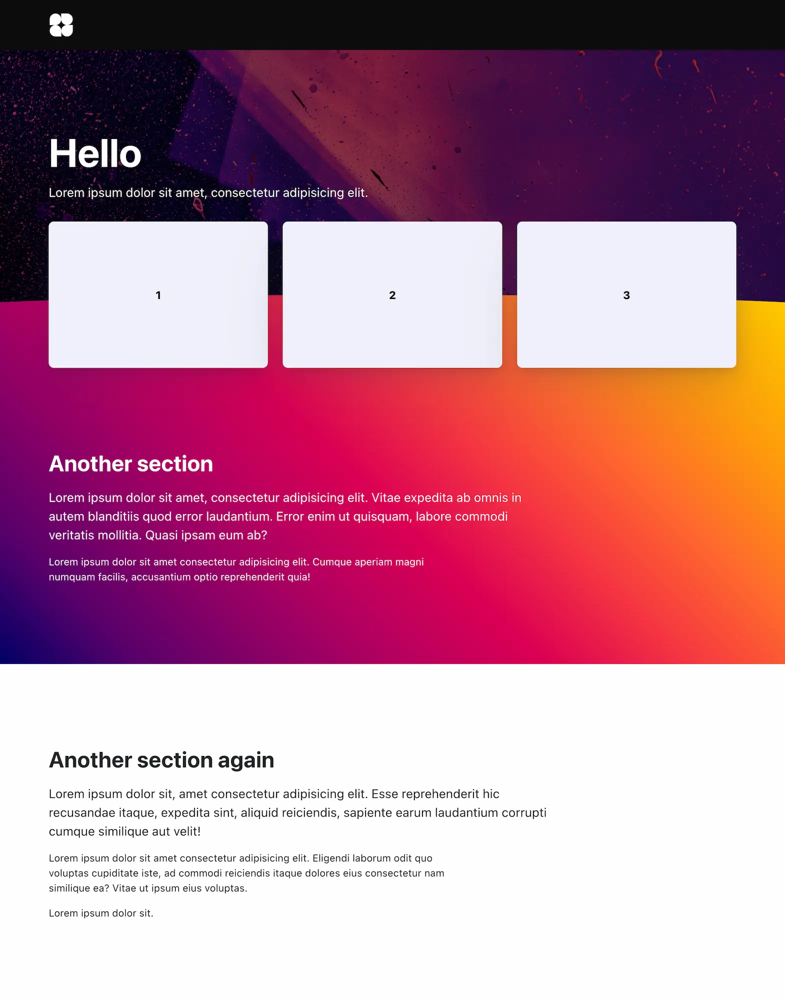
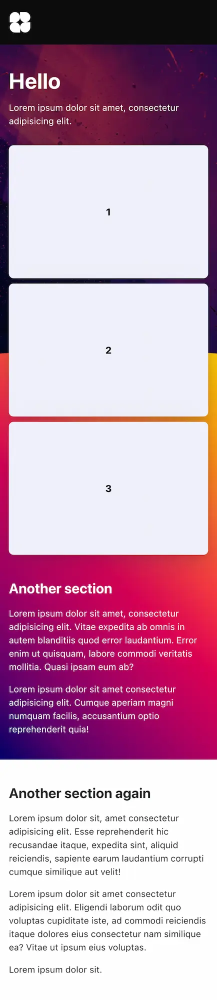
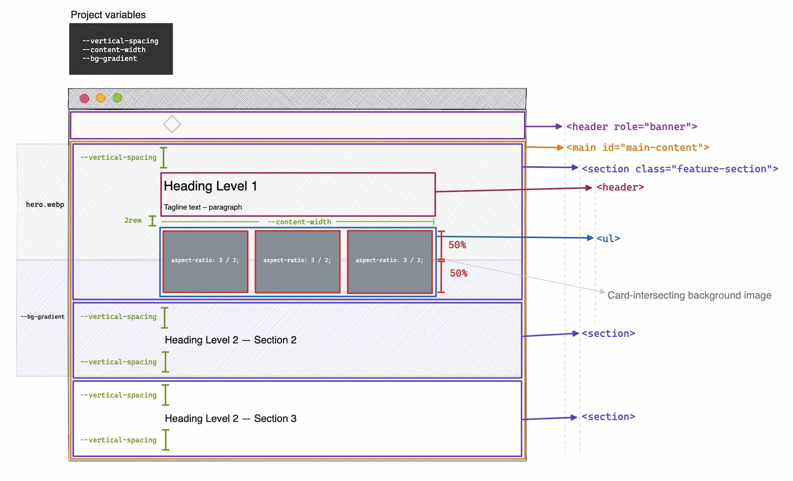
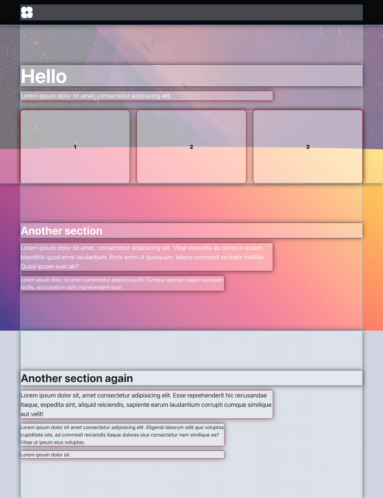

# Rebuild exercises

## Title: Flexible hero

### Rules

- 🚫 You may _NOT_ make changes to "index.html"
- ✅ You may only make changes to "style.css"

### Exercise description

In this exercise your job is to create a flexible hero section with three "feature cards" bisected by the hero image (`hero.webp`) and the gradient background (`--bg-gradient`) of the succeeding section (see references below).

The height of the hero section (`.feature-section`) — as well as the succeeding section — is entirely determined by the content along with the `--vertical-spacing` value (explained below). No matter the amount of content in each of the sections, the bisection of the feature cards should persist.

On mobile, the cards should be stacked vertically with the second card now being bisected by the hero image and the gradient.

For more in-depth details, inspect the _technical drawing_ below.

There are three variables (custom properties) available in this challenge:

- **`--content-width`**: The maximum width of the content
- **`--vertical-spacing`**: A flexible value for the spacing between each section
- **`--bg-gradient`**: The gradient to be used as background for the second section

`css/demo.css` handles the general typography styling, so you don't have to.

#### Extra, extra, extra

As an extra challenge, try to make the hero image curve at the bottom (see the "see through" reference below).

**You may not make changes to the HTML document**.

### References

---

Video

---

Desktop

---

Mobile

---

Technical drawing

---

Wireframe

---

See through version
